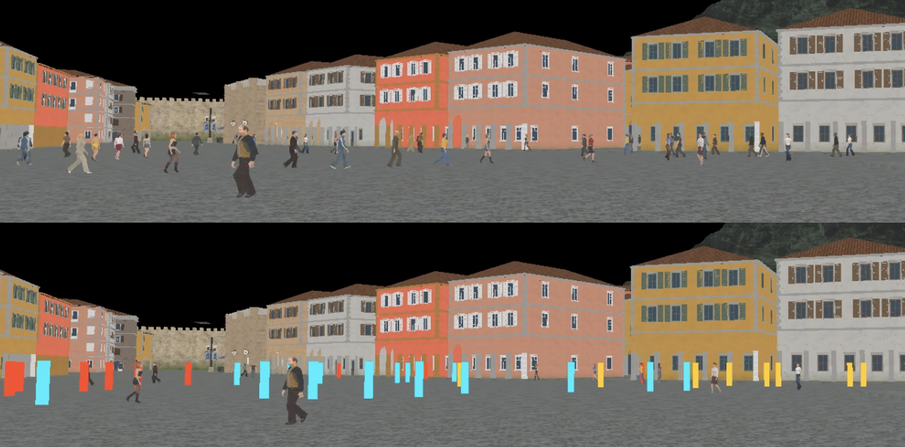

==Typora cheatsheet==

# 一级标题
## 二级标题
### 三级标题
#### 四级标题
##### 五级标题
###### 六级标题
**To bold**
*To Italic*
***To bold plus Italic***
~~to deletw~~
> ### this inicates a **reference**
>
> - to be a reference block
>> - and be more inside

1. itermrize

2. 22
	1. sub itermrize
	
	2. - ss
	
	3. - ss
		
		- ss
- [x] dinner
- this is a line

        I am code

    ` I am code`
```
code brick
sss
```
***
这是一个分隔线
---

This is a link [我的B站主页](https://space.bilibili.com/107938647/dynamic?spm_id_from=444.41.my-info.face.click "一些Vlog")
<https://space.bilibili.com/107938647/dynamic?spm_id_from=444.41.my-info.face.click>




